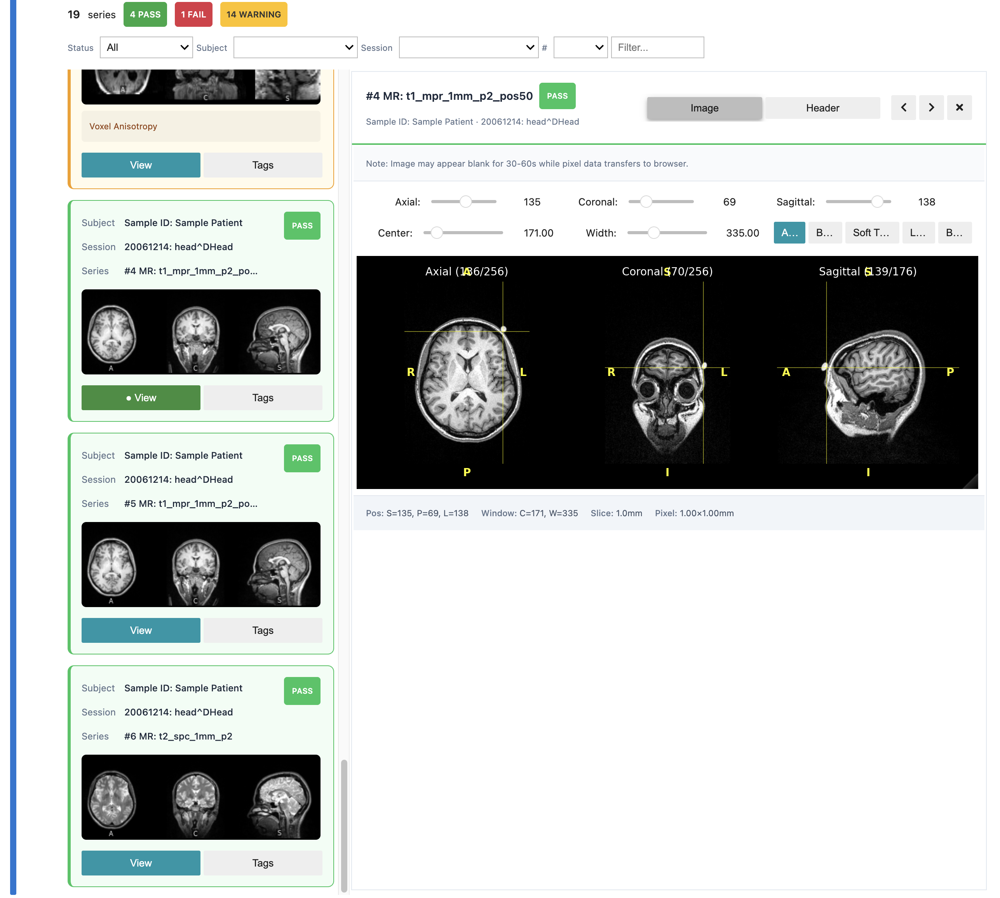
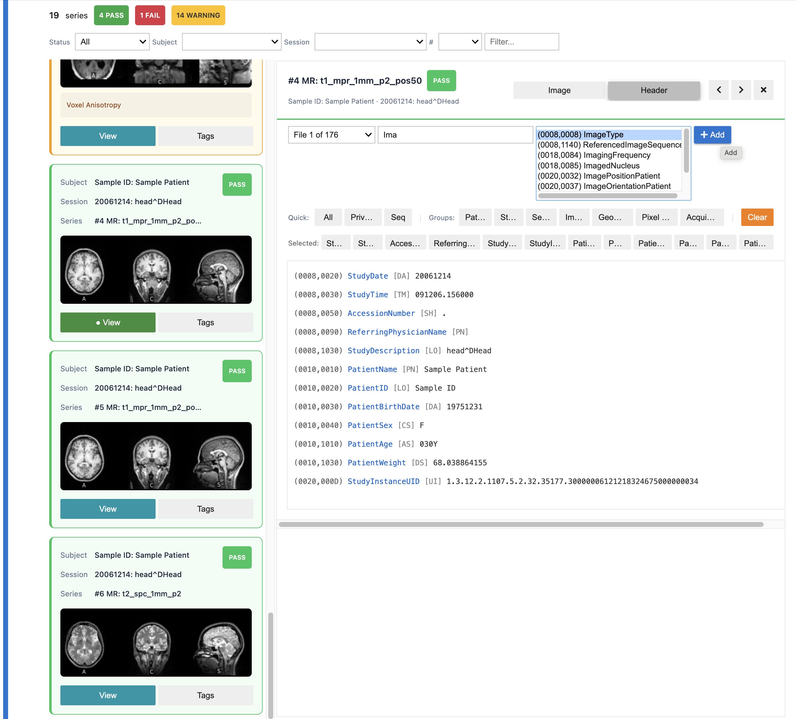

# DICOM QC Library

Batch quality control review of DICOM data within XNAT or on file system using Jupyter notebooks.

## Features

- Automatic discovery of DICOM files from local directories or XNAT projects
- Geometry and metadata validation checks (slice ordering, gaps, anisotropy, etc.)
- Interactive 3-pane viewer for Jupyter notebooks (axial, coronal, sagittal)
- DICOM header browser with tag filtering
- HTML report generation with thumbnails
- Save/restore progress for large datasets
- Detection of viewer compatibility issues (DTI, perfusion, derived series)

<table>
<tr>
<td width="50%">

**3-pane viewer** (axial, coronal, sagittal)



</td>
<td width="50%">

**DICOM header browser** with tag filtering



</td>
</tr>
</table>

## Scaling

Tested up to 100K series with:
- SQLite database for fast filtering/pagination
- Disk-cached thumbnails (~10KB each vs base64 in memory)
- Parallel processing with auto-save

Storage in `{data_dir}/_dicom_qc/` (database, thumbnails, state).

## Feedback

Please submit an Issue!

## Installation

### For Local Use

```bash
# Clone the repository
git clone https://github.com/embarklabs-ai/dicom_qc.git
cd dicom_qc

# Install with uv (recommended)
uv pip install .

# Or with pip
pip install .
```

### For XNAT Integration

```bash
# Install with XNAT support
uv pip install ".[xnat]"
```

### For Development

```bash
# Install in editable mode with dev dependencies
uv pip install -e ".[dev]"
```

## Quick Start

```bash
git clone https://github.com/embarklabs-ai/dicom_qc.git
cd dicom_qc
uv pip install .
uv pip install jupyterlab
uv run jupyter lab
# Open examples/local.ipynb, set DATA_DIR, run all cells
```

## Notebooks

| Notebook | Use Case |
|----------|----------|
| `examples/local.ipynb` | QC review of local DICOM data |
| `examples/xnat.ipynb` | QC review from XNAT project |
| `examples/local_dev.ipynb` | Development (uses editable install) |

<details>
<summary><strong>Architecture</strong></summary>

### Core Components

| Component | File | Description |
|-----------|------|-------------|
| **QuickCheck** | `quickcheck.py` | Main entry point - discovers files, runs QC, generates reports |
| **DicomVolume** | `core/volume.py` | Loaded DICOM volume with metadata and LPS reorientation |
| **GeometryQC** | `core/geometry.py` | Validation checks (slice ordering, gaps, anisotropy) |
| **MultiViewViewer** | `widgets/multiview.py` | Interactive 3-pane Jupyter viewer |
| **DicomHeaderViewer** | `widgets/multiview.py` | DICOM tag browser with filtering |
| **DicomLoader** | `core/dicom_loader.py` | DICOM loading and parsing |

### Dependencies

| Library | Purpose |
|---------|---------|
| **SimpleITK** | Volume loading with correct 3D geometry and orientation |
| **pydicom** | DICOM tag parsing for metadata extraction |
| **numpy** | Array operations |
| **matplotlib** | Visualization rendering |
| **ipympl** | Interactive matplotlib widget backend for Jupyter |
| **ipywidgets** | Jupyter UI controls (sliders, buttons, layouts) |

### Why both SimpleITK and pydicom?

- **SimpleITK** loads DICOM series as properly-oriented 3D volumes, interpreting `ImagePositionPatient`, `ImageOrientationPatient`, and slice ordering.
- **pydicom** provides direct access to DICOM tags for metadata extraction and detecting special cases (JPEG-2000, missing temporal metadata) that SimpleITK abstracts away.

### How matplotlib and ipympl work together

1. **matplotlib** renders the figure to an in-memory canvas
2. **ipympl** (`%matplotlib widget`) wraps it as a Jupyter widget for live updates and mouse events
3. **ipywidgets** provides UI controls and layout

The `%matplotlib widget` magic must be called before importing matplotlib.

</details>

## QC Checks

**Geometry checks** (per volume): Metadata completeness, 4D data detection, reconstructability, slice ordering, orientation consistency, frame of reference, gap detection, voxel anisotropy, slice count.

**DICOM-level checks** (per series): JPEG-2000 encoding issues, missing temporal metadata.

## HTML Reports

```python
qc.generate_html_report('qc_report.html')
```

Reports include summary statistics, thumbnail grid, status filters, and OHIF viewer links (when connected to XNAT).

<details>
<summary><strong>Troubleshooting</strong></summary>

| Problem | Solution |
|---------|----------|
| "widget is not a recognized GUI loop" | Restart kernel after installing ipympl, run `%matplotlib widget` before imports |
| Viewer blank for 30-60 seconds | Normal - ipympl transfers pixel data via WebSocket |
| Import errors | Run `uv pip install ".[xnat]"` for XNAT support |

</details>

## License

MIT
